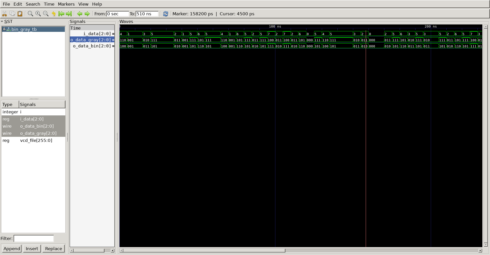

# Gray Code Converter
## Operation Principle
- Consecutive numbers differ in only one bit position
- Bin -> Gray
	- G[N-1] 	= B[N-1]
	- G[i]		= B[i+1] ^ B[i] (N-1>i>=G0)

- Gray -> Bin
	- B[N-1] 	= G[N-1]
	- B[i]		= B[i+1] ^ G[i] (N-1>i>=0)

## Verilog Code
### DUT
```verilog
	
module gray_to_bin
#(
	parameter BW_DATA = 8
)
(
	input	[BW_DATA-1:0]	i_data,
	output	[BW_DATA-1:0]	o_data
);

assign o_data[BW_DATA-1] = i_data[BW_DATA -1];

genvar i;
generate 
	for(i = 0; i < BW_DATA-1; i = i +1) begin
		assign o_data[i] = o_data[i+1] ^ i_data[i];
	end
endgenerate


endmodule
```
```verilog

module bin_to_gray
#(
	parameter BW_DATA = 8
)
(
	input	[BW_DATA-1:0]	i_data,
	output	[BW_DATA-1:0]	o_data
);


assign o_data[BW_DATA-1] = i_data[BW_DATA -1];

genvar i;
generate 
	for(i = 0; i < BW_DATA-1; i = i +1) begin
		assign o_data[i] = i_data[i+1] ^ i_data[i];
	end
endgenerate

endmodule
```

### Testbench
```verilog

`define		CLKFREQ		100
`define		SIMCYCLE	100

`include "bin_to_gray.v"
`include "gray_to_bin.v"

module bin_gray_tb;
//---------------------------------------------------
// DUT Signals & Intanciate
//---------------------------------------------------
	parameter 	BW_DATA = 8;

	reg			[BW_DATA-1:0]	i_data;
	wire		[BW_DATA-1:0]	o_data_bin;
	wire		[BW_DATA-1:0]	o_data_gray;

	bin_to_gray
	#(
		.BW_DATA			(BW_DATA			)
	)
	u_bin_to_gray(
		.i_data				(i_data				),
		.o_data				(o_data_gray		)
	);


	gray_to_bin
	#(
		.BW_DATA			(BW_DATA			)
	)
	u_gray_to_bin
	(
		.i_data				(o_data_gray		),
		.o_data				(o_data_bin			)
	);


//---------------------------------------------------
//Stimulus
//---------------------------------------------------
integer i, j;

initial begin
	for (i=0; i<`SIMCYCLE; i++) begin
		i_data = $urandom;
		#(500/`CLKFREQ);
	end
	#(1000/`CLKFREQ);
	$finish;
end

// --------------------------------------------------
//	Dump VCD
// --------------------------------------------------
	reg	[8*32-1:0]	vcd_file;
	initial begin
		if ($value$plusargs("vcd_file=%s", vcd_file)) begin
			$dumpfile(vcd_file);
			$dumpvars;
		end else begin
			$dumpfile("bin_gray_tb.vcd");
			$dumpvars;
		end
	end

endmodule


```
## Simulation Result
-	@ 0ns
	- idata = 8'h24(8'b0010_0100) 	-> gray = 0011_0110
	- gray  = 0011_0110 	-> bin  = 0010_0100
- 	@5ns
	- idata = 8'h81(8'b1000_0001) 	-> gray = 1100_0001
	- gray  = 1100_0001 	-> bin  = 1000_0001
-	@10ns
	- idata = 8'h09(8'b0000_1001) 	-> gray = 0000_1101
	- gray  = 0000_1101 	-> bin  = 0000_1001



