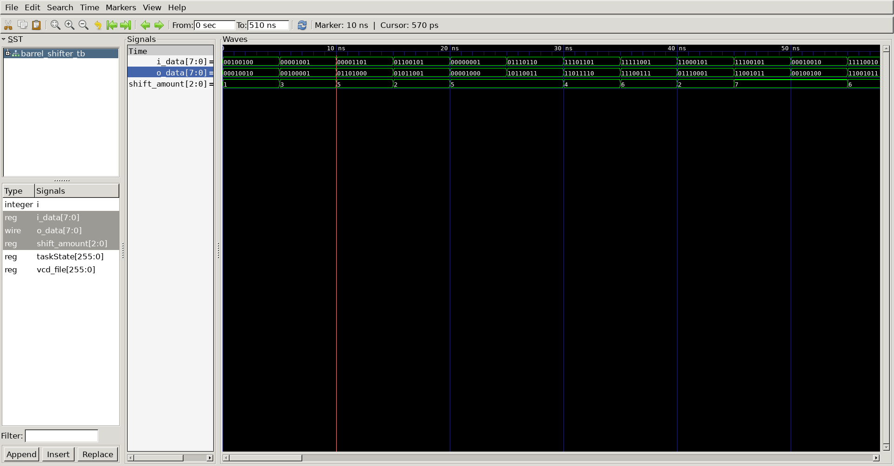

# 8-bit Barrel Shifter
## Operation Principle
 - rotate amount depends on k.
 - then right shift A
 - Ex) A = 0100, k = 2 it means that 2bit right shift -> result : 0001

# Verilog Code
### DUT
```verilog
module barrel_shifter(
	input	[2:0]	k,
	input	[7:0]	i_data,
	output	[7:0]	o_data
);

	wire	[7:0]	w_data;
	wire	[7:0]	y_data;
//---------------------------------------------------
// 4 bit shift
//---------------------------------------------------

genvar i;
generate
	for(i = 0; i < 4; i = i+1) begin
	mux
	u_mux(
		.i_sel				(k[2]		),
		.i_data0			(i_data[i]		),
		.i_data1			(i_data[i+4]	),
		.o_data				(w_data[i]			)
	);
	end
endgenerate

generate
	for(i = 4; i < 8; i = i+1) begin
	mux
	u_mux(
		.i_sel				(k[2]		),
		.i_data0			(i_data[i]		),
		.i_data1			(i_data[i-4]	),
		.o_data				(w_data[i]			)
	);
end
endgenerate

//---------------------------------------------------
// 2 bit shift
//---------------------------------------------------

genvar j;
generate
	for(j = 0; j < 6; j = j+1) begin
	mux
	u_mux(
		.i_sel				(k[1]		),
		.i_data0			(w_data[j]		),
		.i_data1			(w_data[j+2]	),
		.o_data				(y_data[j]			)
	);
	end
endgenerate

generate
	for(j = 6; j < 8; j = j+1) begin
	mux
	u_mux(
		.i_sel				(k[1]		),
		.i_data0			(w_data[j]		),
		.i_data1			(w_data[j-6]	),
		.o_data				(y_data[j]			)
	);
	end
endgenerate

//---------------------------------------------------
// 1 bit shift
//---------------------------------------------------

genvar l;
generate
	for(l = 0; l < 7; l = l+1) begin
	mux
	u_mux(
		.i_sel				(k[0]		),
		.i_data0			(y_data[l]		),
		.i_data1			(y_data[l+1]	),
		.o_data				(o_data[l]			)
	);
	end
endgenerate

	mux
	u_mux(
		.i_sel				(k[0]		),
		.i_data0			(y_data[7]		),
		.i_data1			(y_data[0]	),
		.o_data				(o_data[7]			)
	);

	
endmodule


module mux(
	input		i_sel,
	input		i_data0,
	input		i_data1,
	output		o_data
);

assign o_data = (i_sel == 1) ? i_data1 : i_data0;

endmodule
```

### Testbench
```verilog

`define		CLKFREQ		100
`define		SIMCYCLE	100

`include "barrel_shifter.v"

module barrel_shifter_tb;
//---------------------------------------------------
// DUT Signals & Intanciate
//---------------------------------------------------
	reg		[2:0]	shift_amount;
	reg		[7:0]	i_data;
	wire	[7:0]	o_data;

	barrel_shifter
	u_barrel_shifter(
		.k					(shift_amount		),
		.i_data				(i_data				),
		.o_data				(o_data				)
	);

//---------------------------------------------------
// Tasks
//---------------------------------------------------
reg	[8*32-1:0] taskState;

task init;
	begin
		taskState 		= "Init";
		shift_amount 	= 0;
		i_data 			= 0;
	end
endtask

//---------------------------------------------------
//Stimulus
//---------------------------------------------------
integer i, j;

initial begin
	init();

	for (i=0; i<`SIMCYCLE; i++) begin
		i_data 			= $urandom;
		shift_amount 	= $urandom;
		#(500/`CLKFREQ);
	end
	#(1000/`CLKFREQ);
	$finish;
end

// --------------------------------------------------
//	Dump VCD
// --------------------------------------------------
	reg	[8*32-1:0]	vcd_file;
	initial begin
		if ($value$plusargs("vcd_file=%s", vcd_file)) begin
			$dumpfile(vcd_file);
			$dumpvars;
		end else begin
			$dumpfile("barrel_shifter_tb.vcd");
			$dumpvars;
		end
	end

endmodule
```
## Simulation Result
- @ 10ns
	- i_data = 0000_1101, k = 5 -> result = 0110_1000
- @ 15ns
	- i_data = 0110_0101, k = 2 -> result = 0101_1001
- @ 20ns
	- i_data = 0000_0001, k = 5 -> result = 0000_1000


