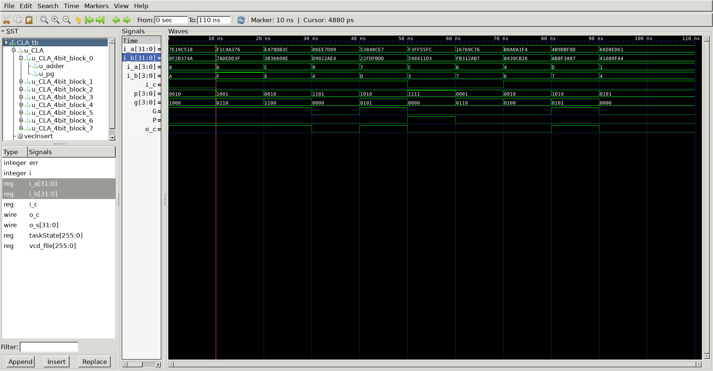
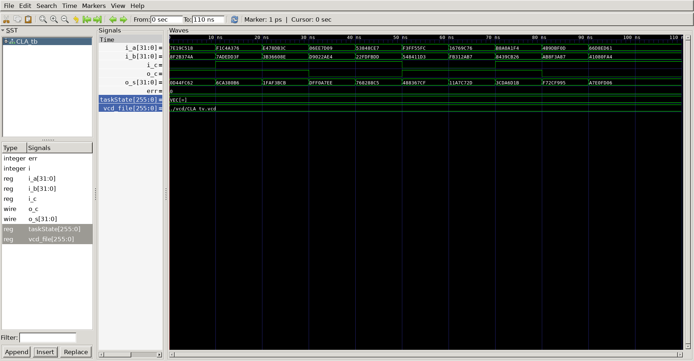

# 32-bit Carry-Lookahead Adder
## Operation Principles
	- carry-lookahead adder is faster than ripple-carry adder.
	- ripple-carry adder's each digit requires previous digit operation output. so it has more delay
	- carry-lookahead adder use two definition(generate, propagate). each digit operates without previous output. 
	- use two definition
		- generate : make carry_out independent of carry_in
			- gi = ai & bi
		- propagate : make carry_out when carry_in comes
			- pi = ai ^ bi 
	- use 4-bit block
		- input		: a[3:0], b[3:0], cin
		- output	: s[3:0], c_out
		- G 	= g3 + p3(g2 + p2(g1 + p1 * g0))
		- P 	= p3 * p2 * p1 * p0
		- c_out	= G + P * c_in

# Verilog
### DUT
```verilog
		
module CLA(
	input	[31:0]	i_a,
	input	[31:0]	i_b,
	input			i_c,
	output			o_c,
	output	[31:0]	o_s
);

	wire	[6:0]	w_c;

	CLA_4bit_block
	u_CLA_4bit_block_0(
		.i_a				(i_a[3:0]			),
		.i_b				(i_b[3:0]			),
		.i_c				(i_c				),
		.o_c				(w_c[0]				),
		.o_s				(o_s[3:0]			)
	);

	CLA_4bit_block
	u_CLA_4bit_block_1(
		.i_a				(i_a[7:4]			),
		.i_b				(i_b[7:4]			),
		.i_c				(w_c[0]				),
		.o_c				(w_c[1]				),
		.o_s				(o_s[7:4]			)
	);

	CLA_4bit_block
	u_CLA_4bit_block_2(
		.i_a				(i_a[11:8]			),
		.i_b				(i_b[11:8]			),
		.i_c				(w_c[1]				),
		.o_c				(w_c[2]				),
		.o_s				(o_s[11:8]			)
	);

	CLA_4bit_block
	u_CLA_4bit_block_3(
		.i_a				(i_a[15:12]			),
		.i_b				(i_b[15:12]			),
		.i_c				(w_c[2]				),
		.o_c				(w_c[3]				),
		.o_s				(o_s[15:12]			)
	);

	CLA_4bit_block
	u_CLA_4bit_block_4(
		.i_a				(i_a[19:16]			),
		.i_b				(i_b[19:16]			),
		.i_c				(w_c[3]				),
		.o_c				(w_c[4]				),
		.o_s				(o_s[19:16]			)
	);

	CLA_4bit_block
	u_CLA_4bit_block_5(
		.i_a				(i_a[23:20]			),
		.i_b				(i_b[23:20]			),
		.i_c				(w_c[4]				),
		.o_c				(w_c[5]				),
		.o_s				(o_s[23:20]			)
	);

	CLA_4bit_block
	u_CLA_4bit_block_6(
		.i_a				(i_a[27:24]			),
		.i_b				(i_b[27:24]			),
		.i_c				(w_c[5]				),
		.o_c				(w_c[6]				),
		.o_s				(o_s[27:24]			)
	);

	CLA_4bit_block
	u_CLA_4bit_block_7(
		.i_a				(i_a[31:28]			),
		.i_b				(i_b[31:28]			),
		.i_c				(w_c[6]				),
		.o_c				(o_c				),
		.o_s				(o_s[31:28]			)
	);

endmodule


module CLA_4bit_block(
	input	[3:0]	i_a,
	input	[3:0]	i_b,
	input			i_c,
	output			o_c,
	output	[3:0]	o_s
);
	pg
	u_pg(
		.i_a				(i_a				),
		.i_b				(i_b				),
		.i_c				(i_c				),
		.o_c				(o_c				)
	);

	adder
	u_adder(
		.i_a				(i_a				),
		.i_b				(i_b				),
		.i_c				(i_c				),
		.o_s				(o_s				)
	);
endmodule
```

```verilog 
module pg(
	input	[3:0]	i_a,
	input	[3:0]	i_b,
	input			i_c,
	output			o_c,
	output	[3:0]	o_s
);

	wire	[3:0]	p;
	wire	[3:0]	g;
	wire 			P;
	wire			G;
	wire	[2:0]	c;

genvar i;
generate 
	for(i = 0; i < 4; i = i + 1) begin
		assign 	p[i] = i_a[i] ^ i_b[i];
		assign 	g[i] = i_a[i] & i_b[i];
	end 
endgenerate

assign c[0] = g[0] || (p[0] && i_c);
assign c[1] = g[1] || (p[1] && c[0]);
assign c[2] = g[2] || (p[2] && c[1]);

assign o_s = p ^ { c, i_c};

assign P = &p;
assign G = g[3] | (p[3] & (g[2] | p[2] & (g[1] | (p[1] & g[0]))));
assign o_c = G | (P & i_c);

endmodule
```
### Testbench
```verilog 

//-------------------------------------
// Define Global Variables
// ------------------------------------
`define CLKFREQ     100
`define SIMCYCLE    `NVEC
`define	NVEC		10

`include "CLA.v"

module CLA_tb;
//---------------------------------------------------
//DUT Signals & Instantiate
//---------------------------------------------------
	reg		[31:0]	i_a;
	reg		[31:0]	i_b;
	reg				i_c;
	wire			o_c;
	wire	[31:0]	o_s;

	CLA
	u_CLA(
		.i_a				(i_a				),
		.i_b				(i_b				),
		.i_c				(i_c				),
		.o_c				(o_c				),
		.o_s				(o_s				)
	);

//---------------------------------------------------
// Test Vector Configuration
//---------------------------------------------------
reg		[31:0]	vi_a[0:`NVEC-1];
reg		[31:0]	vi_b[0:`NVEC-1];
reg				vi_c[0:`NVEC-1];
reg		[31:0]	vo_s[0:`NVEC-1];
reg				vo_c[0:`NVEC-1];

initial begin
	$readmemb("./vec/i_a.vec",	vi_a);
	$readmemb("./vec/i_b.vec",	vi_b);
	$readmemb("./vec/i_c.vec",	vi_c);
	$readmemb("./vec/o_s.vec",	vo_s);
	$readmemb("./vec/o_c.vec",	vo_c);
end	

//---------------------------------------------------
// Task
//---------------------------------------------------
reg		[8*32-1:0]	taskState;
integer				err = 0;

task init;
	begin
		taskState		= "Init";
		i_a				= 0;
		i_b				= 0;
		i_c				= 0;
	end	
endtask

task vecInsert;
	input		[$clog2(`NVEC)-1:0]	i;
	begin
		$sformat(taskState, "VEC[=]", i);
		i_a				= vi_a[i];
		i_b				= vi_b[i];
		i_c				= vi_c[i];
	end 
endtask

task vecVerify;
	input		[$clog2(`NVEC)-1:0]	i;
	begin
		#(0.1*1000/`CLKFREQ);
		if(o_s != vo_s[i]) begin
			$display("[Idx: =] Mismatched o_s", i); 
		end
		if(o_c != vo_c[i]) begin
			$display("[Idx: =] Mismatched o_c", i); 
		end
		if((o_s != vo_s[i]) || (o_c != vo_c[i])) begin	
			err = err + 1;
		end
		#(0.9*1000/`CLKFREQ);
	end	
endtask	

//---------------------------------------------------
//Stimulus
//---------------------------------------------------
integer i;

initial begin
	init();
	for (i=0; i<`SIMCYCLE; i++) begin
		vecInsert(i);
		vecVerify(i);
	end
	#(1000/`CLKFREQ);
	$finish;
end

// --------------------------------------------------
//	Dump VCD
// --------------------------------------------------
	reg	[8*32-1:0]	vcd_file;
	initial begin
		if ($value$plusargs("vcd_file=%s", vcd_file)) begin
			$dumpfile(vcd_file);
			$dumpvars;
		end else begin
			$dumpfile("CLA_tb.vcd");
			$dumpvars;
		end
	end

endmodule
```
### Testvector
```python 
#! /usr/bin/python3

import os
import sys
import random

os.getcwd()
os.system('mkdir -p vec')
file_o_s	= './vec/o_s.vec'
file_o_c    = './vec/o_c.vec'
file_i_a    = './vec/i_a.vec'
file_i_b    = './vec/i_b.vec'
file_i_c    = './vec/i_c.vec'

fh_o_s		= open(file_o_s,	'w')
fh_o_c      = open(file_o_c,	'w')
fh_i_a      = open(file_i_a,	'w')
fh_i_b      = open(file_i_b,	'w')
fh_i_c      = open(file_i_c,	'w')

simNum      = 10
bitWidth    =32
for n in range(simNum):
	intMIN, intMAX = 0, pow(2,bitWidth)-1
	intA    = random.randint(intMIN, intMAX)
	intB    = random.randint(intMIN, intMAX)
	intC    = random.randint(intMIN, 1)
	intSUM  = intA + intB + intC
	binA	= bin(intA	)[2:].rjust(bitWidth,'0')
	binB	= bin(intB  )[2:].rjust(bitWidth,'0')
	binC	= bin(intC  )[2:].rjust(1, '0')
	binSUM  = bin(intSUM)[2:].rjust(bitWidth+1,'0')
	print('--------------------------------------------------')
	print('Iteration: %s'%(n))
	print('--------------------------------------------------')
	print('A   : %33s'%(binA))
	print('B   : %33s'%(binB))
	print('C   : %33s'%(binC))
	print('SUM : %33s'%(binSUM))
	print('--------------------------------------------------')
	fh_o_s.write(binSUM[1:bitWidth+1] + '\n')
	fh_o_c.write(binSUM[0] + '\n')
	fh_i_a.write(binA + '\n')
	fh_i_b.write(binB + '\n')
	fh_i_c.write(binC + '\n')
fh_o_s.close()
fh_o_c.close()
fh_i_a.close()
fh_i_b.close()
fh_i_c.close()
```
## Simulation Result
- @0ns
	- i_a = 0x7E19C518, i_b = 0x8F2B374A, i_c = 0
	
	-> i_a[3:0] = 8, 		i_b[3:0] = A,		i_c = 0
	
	->   g[3:0]	= 4'b1000,	  p[3:0] = 4'b0010
	
	->		  G = 1,			   P = 0
	
	->	   cout = 1
	
	-> ... result : o_s[31:0] = 0x0D44_FC62, o_c = 1



