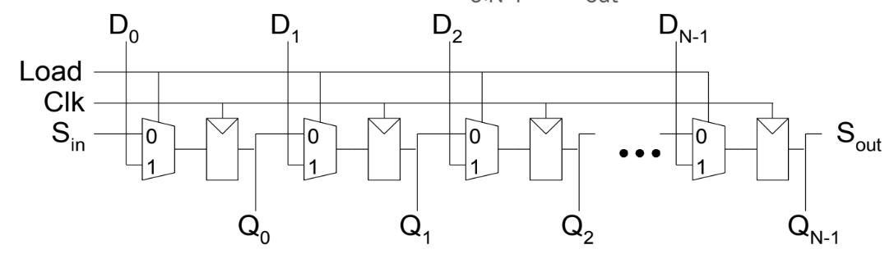
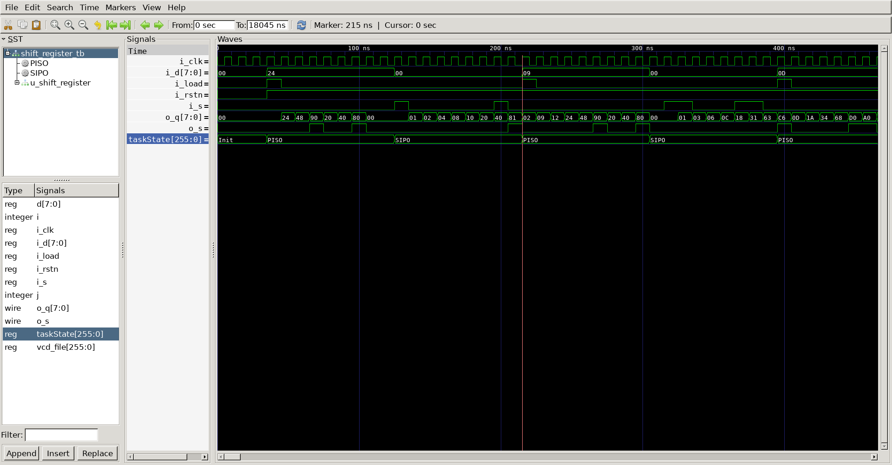

# 8-bit Shift Register
## Operation Principle


	- Serial to parallel converter
		- Load = 0
		- input Sin -> ouput Q[7:0]
		- Sin = 1 -> Q = 0b0001 , 1clk after Sin = 0 -> Q = 0b0010, 1clk after Sin = 1 -> Q = 0b0101

	- Parallel to serial converter
		- 1st clk : laod = 1, other clk : load = 0
		- input D[7:0] -> output Sout
		- D = 0x01 -> Sout = 0 0 0 0 0 0 0 1 
## Verilog Code
### DUT
```verilog 
module shift_register(
	input				i_clk,
	input				i_rstn,
	input				i_load,
	input		[7:0]	i_d,
	input 				i_s,
	output		[7:0]	o_q,	
	output				o_s
);

	wire		[7:0] 	w_out;

	mux2to1
	u_mux2to1_0(
		.i_sel				(i_load				),
		.i_data0			(i_s				),
		.i_data1			(i_d[0]				),
		.o_data				(w_out[0]			)
	);

	dff
	u_dff0(
		.i_clk				(i_clk				),
		.i_rstn				(i_rstn				),
		.i_data				(w_out[0]			),
		.o_data				(o_q[0]				)
	);

genvar i;
generate
	for(i = 0; i < 7; i = i + 1) begin
	mux2to1
	u_mux2to1(
		.i_sel				(i_load				),
		.i_data0			(o_q[i]				),
		.i_data1			(i_d[i+1]			),
		.o_data				(w_out[i+1]			)
	);
		dff
	u_dff(
		.i_clk				(i_clk				),
		.i_rstn				(i_rstn				),
		.i_data				(w_out[i+1]			),
		.o_data				(o_q[i+1]			)
	);
end
endgenerate

	assign o_s = o_q[7];

endmodule


module mux2to1(
	input		i_sel,
	input		i_data0,
	input		i_data1,
	output		o_data
);

assign o_data = (i_sel) ? i_data1 : i_data0;

endmodule

module dff(
	input			i_clk,
	input			i_rstn,
	input			i_data,
	output reg		o_data
);

always @(posedge i_clk or negedge i_rstn) begin
	if(!i_rstn) begin
		o_data <= 0;
	end
	else begin
		o_data <= i_data;
	end
end

endmodule
```
### Testbench
```verilog 
//-------------------------------------
// Define Global Variables
// ------------------------------------
`define CLKFREQ     100
`define SIMCYCLE    100

`include "shift_register.v"

module shift_register_tb;
//---------------------------------------------------
//DUT Signals & Instantiate
//---------------------------------------------------
	reg					i_clk;
	reg					i_rstn;
	reg					i_load;
	reg			[7:0]	i_d;
	reg 				i_s;
	wire		[7:0]	o_q;	
	wire				o_s;

	shift_register
	u_shift_register(
		.i_clk				(i_clk				),
		.i_rstn				(i_rstn				),
		.i_load				(i_load				),
		.i_d				(i_d				),
		.i_s				(i_s				),
		.o_q				(o_q				),
		.o_s				(o_s				)
	);

//---------------------------------------------------
// Clock
//---------------------------------------------------
always #(500/`CLKFREQ) i_clk = ~i_clk;

//---------------------------------------------------
// Tasks
//---------------------------------------------------
reg     [8*32-1:0]  taskState;

task init;
    begin
		taskState 	= "Init";
		i_clk		= 0;
		i_rstn		= 0;
		i_load		= 0;
		i_d			= 0;
		i_s			= 0;
		repeat (4) @(posedge i_clk);
		i_rstn		= 1;
    end
endtask

integer i;

task PISO;
	input 	[7:0] d;
	begin
		taskState = "PISO";
		i_load = 1;
		i_d = d;
		@(posedge i_clk);
		i_load = 0;
		repeat(7) @(posedge i_clk);
	end
endtask

task SIPO;
	input 	[7:0] d;
	begin
		taskState = "SIPO";
		i_load = 0;
		for(i = 0; i < 8; i = i + 1) begin
			i_s = d[7-i];
			@(posedge i_clk);
		end
		i_s = 0;
		@(posedge i_clk);
	end
endtask


//---------------------------------------------------
//Stimulus
//---------------------------------------------------
integer j;

reg		[7:0]	d;

initial begin
	init();
	for (j=0; j<`SIMCYCLE; j++) begin
		i_d = $urandom;
		d	= 0;
		PISO(i_d);
		@(posedge i_clk);
		i_d = 0;
		d	= $urandom;
		SIPO(d);
	end
	#(1000/`CLKFREQ);
	$finish;
end

// --------------------------------------------------
//	Dump VCD
// --------------------------------------------------
	reg	[8*32-1:0]	vcd_file;
	initial begin
		if ($value$plusargs("vcd_file=%s", vcd_file)) begin
			$dumpfile(vcd_file);
			$dumpvars;
		end else begin
			$dumpfile("shift_register_tb.vcd");
			$dumpvars;
		end
	end

endmodule
```

## Simulation
	- @35ns
		- i_d = 0x24 = 0b0010_0100 
	- @45ns
		- o_s = 0
	- @55ns
		- o_s = 0
	- @65ns
		- o_s = 1
	- @75ns
		- o_s = 0
	- @85ns
		- o_s = 0
	- @95ns
		- o_s = 1
	- @105ns
		- o_s = 0
	- @115ns
		- o_s = 0
	- @125ns
		- i_s = 1 
	- @135ns
		- o_q = 0b0000_0001 // i_s = 0
	- @145ns
		- o_q = 0b0000_0010 // i_s = 0
	- @155ns
		- o_q = 0b0000_0100 // i_s = 0
	- @165ns
		- o_q = 0b0000_1000 // i_s = 0
	- @175ns
		- o_q = 0b0001_0000 // i_s = 0
	- @185ns
		- o_q = 0b0010_0000 // i_s = 0
	- @195ns
		- o_q = 0b0100_0000 // i_s = 1
	- @195ns
		- o_q = 0b1000_0001



