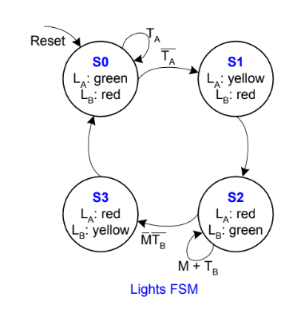
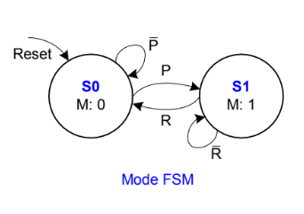
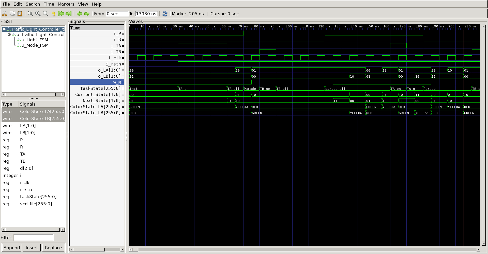

# FSM : Traffic Light Controller
## Operation Principle
 - use two FSM module



 - Light FSM
 	- Traffic Sensor : TA, TB(that means there is a traffic)
	- TA is on -> LA(light A) is a green and LB(light B) is a red
 - Mode FSM
 

 	- P = 1 : enter parade Mode & LB is green
	- R = 1 : leave parade Mode
## Verilog Code
### DUT
```verilog
`include "Mode_FSM.v"
`include "Light_FSM.v"


module Traffic_Light_Controller
(
    input       i_clk,
    input       i_rstn,
    input       i_P,
    input       i_R,
    input       i_TA,
    input       i_TB,
    output [1:0]		o_LA,
    output [1:0]		o_LB    
);
	
	wire		w_M;
	
	Mode_FSM
	u_Mode_FSM(
		.i_clk				(i_clk				),
		.i_rstn				(i_rstn				),
		.i_P				(i_P				),
		.i_R				(i_R				),
		.o_M				(w_M				)
	);

	Light_FSM
	u_Light_FSM(
		.i_clk				(i_clk				),
		.i_rstn				(i_rstn				),
		.i_M				(w_M				),
		.i_TA				(i_TA				),
		.i_TB				(i_TB				),
		.o_LA				(o_LA				),
		.o_LB				(o_LB				)
	);

endmodule
```
```verilog 
module  Light_FSM(
    input       i_clk,
    input       i_rstn,
    input       i_M,
    input       i_TA,
    input       i_TB,
    output reg [1:0]  o_LA,
    output reg [1:0] o_LB
);

    reg [1:0]       Current_State;
    reg [1:0]       Next_State;

    localparam  STATE_0			=   2'b00;
    localparam  STATE_1         =   2'b01;
    localparam  STATE_2         =   2'b10;
    localparam  STATE_3         =   2'b11;

    localparam  GREEN           =   2'b00;
    localparam  RED             =   2'b01;
    localparam  YELLOW          =   2'b10;
    
	
    always @(posedge i_clk or negedge i_rstn) begin
        if(!i_rstn) begin
            Current_State   <= STATE_0;
        end
        else begin
            Current_State   <= Next_State;
        end
    end

    always @(*) begin
        case(Current_State)
            STATE_0 : begin
				Next_State = (i_TA) ? STATE_0 : STATE_1;
            end
            STATE_1 : begin
                Next_State = STATE_2;
            end
            STATE_2 : begin
                if(i_M == 1'b1 || i_TB == 1'b1)       
                    Next_State <= STATE_2;
                else if(i_M == 1'b0 && i_TB == 1'b0)  
                    Next_State <= STATE_3;
			end
			STATE_3 : begin
                Next_State = STATE_0;
            end
            default : begin
                Next_State = STATE_0;
            end 
        endcase
    end

    always @(*) begin
        case(Current_State)
            STATE_0 : begin
                o_LA    =   GREEN;
                o_LB    =   RED;
            end
            STATE_1 : begin
                o_LA    =   YELLOW;
                o_LB    =   RED;  
            end
            STATE_2 :   begin
                o_LA    =   RED;
                o_LB    =   GREEN;
            end
            STATE_3 :   begin
                o_LA    =   RED;
                o_LB    =   YELLOW;
            end
            default :   begin
                o_LA    =   RED;
                o_LB    =   RED;
            end
        endcase
    end
endmodule
```
```verilog 
module Mode_FSM
(
    input       i_clk,
    input       i_rstn,
    input       i_P,
    input       i_R,
    output reg  o_M
);

    reg         Current_State;
    reg         Next_State;

    localparam  S_IDLE          =   1'b0;
    localparam  S_PARADE        =   1'b1;

    always @(posedge i_clk or negedge i_rstn) begin
        if(!i_rstn) begin
            Current_State   <= S_IDLE;
        end
        else begin
            Current_State   <= Next_State;
        end
    end

    always @(*) begin
		case(Current_State)
			S_IDLE 		: Next_State = (i_P) ? S_PARADE : S_IDLE;
			S_PARADE 	: Next_State = (i_R) ? S_IDLE	: S_PARADE;
		endcae	
    end

    always @(*) begin
        case(Current_State)
            S_PARADE    :   o_M = 1'b1;
            default     :   o_M = 1'b0;
        endcase
    end
endmodule
```

### Testbench

```verilog
//-------------------------------------
// Define Global Variables
// ------------------------------------
`define CLKFREQ     100
`define SIMCYCLE    100

`include "Traffic_Light_Controller.v"

module Traffic_Light_Controller_tb;
//---------------------------------------------------
//DUT Signals & Instantiate
//---------------------------------------------------
	reg       	i_clk;
	reg       	i_rstn;
	reg       	P;
	reg       	R;
	reg       	TA;
	reg       	TB;
	wire [1:0]		LA;
	wire [1:0]		LB;

	Traffic_Light_Controller
	u_Traffic_Light_Controller(
		.i_clk				(i_clk				),
		.i_rstn				(i_rstn				),
		.i_P				(P				),
		.i_R				(R				),
		.i_TA				(TA				),
		.i_TB				(TB				),
		.o_LA				(LA				),
		.o_LB				(LB				)
	);

//---------------------------------------------------
// Clock
//---------------------------------------------------
always #(500/`CLKFREQ) i_clk = ~i_clk;

//---------------------------------------------------
// Tasks
//---------------------------------------------------
reg     [8*32-1:0]  taskState;

task init;
    begin
		taskState 	= "Init";
		i_clk		= 0;
		i_rstn		= 0;
		P 		= 0;
        R 		= 0;
        TA		= 0;
        TB		= 0;
		repeat (4) @(negedge i_clk);
		i_rstn		= 1;
    end
endtask

task A_load_has_car;
	begin
		taskState = "TA_on";
		TA = 1'b1;
	end
endtask

task A_load_has_no_car;
	begin
		taskState = "TA_off";
		TA = 1'b0;
	end
endtask

task B_load_has_car;
	begin
		taskState = "TB_on";
		TB = 1'b1;
	end
endtask

task B_load_has_no_car;
	begin
		taskState = "TB_off";
		TB = 1'b0;
	end
endtask

task enter_parade;
	begin
		taskState = "Parade";
		P = 1'b1;
		R = 1'b0;
	end
endtask

task leave_parade;
	begin
		taskState = "parade_off";
		P = 1'b0;
		R = 1'b1;
	end
endtask

wire [8*32-1:0] ColorState_LA, ColorState_LB;
assign ColorState_LA = (LA == 2'b00) ? "GREEN" :
					(LA == 2'b01) ? "RED"	:
					"YELLOW";
assign ColorState_LB = (LB == 2'b00) ? "GREEN" :
					(LB == 2'b01) ? "RED"	:
					"YELLOW";

//---------------------------------------------------
//Stimulus
//---------------------------------------------------
integer i;

reg		[2:0]	d;

initial begin
	init();
	for (i=0; i<`SIMCYCLE; i++) begin
	A_load_has_car;
	d=$urandom_range(3'd1, 3'd4);
	repeat(d) @(negedge i_clk);
	A_load_has_no_car;
	d=$urandom_range(3'd1, 3'd4);
	repeat(d) @(negedge i_clk);
	enter_parade;
	d=$urandom_range(3'd1, 3'd4);
	repeat(d) @(negedge i_clk);
	B_load_has_car;
	d=$urandom_range(3'd1, 3'd4);
	repeat(d) @(negedge i_clk);
	B_load_has_no_car;
	d=$urandom_range(3'd1, 3'd4);
	repeat(d) @(negedge i_clk);
	leave_parade;
	d=$urandom_range(3'd1, 3'd4);
	repeat(d) @(negedge i_clk);


	end
	#(1000/`CLKFREQ);
	$finish;
end

// --------------------------------------------------
//	Dump VCD
// --------------------------------------------------
	reg	[8*32-1:0]	vcd_file;
	initial begin
		if ($value$plusargs("vcd_file=%s", vcd_file)) begin
			$dumpfile(vcd_file);
			$dumpvars;
		end else begin
			$dumpfile("Traffic_Light_Controller_tb.vcd");
			$dumpvars;
		end
	end
endmodule
```
## Simulation Result
	- @0n
		- init -> LA = green / LB = red
	- @30n
		- TA = 1 -> @35n : LA = green / LB = red
	- @60n
		- TA = 0 -> @65n : LA = yellow / LB = red 

				 -> @75n : LA = red / LB = green
	- @70n
		- P = 1  -> LA = red / LB = green is stay for 135ns
	- @120n
		- R = 1  -> @135ns LA = red / LB = yellow 


