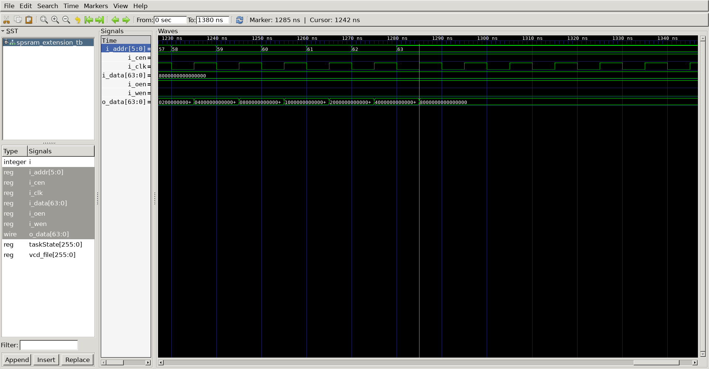

### SRAM Extension
## Operation Principle
	- single port sram 
	 	- chip_enable && write_enable is high -> write a data in input address
	 	- chip_enable && out_enable is high and write_enable is low -> read a data in input address
	 	- can choose synchronous or asynchronous memory_read
	- sram unit is 4-bit address & 32bit data
	- target memory is 6bit address & 64bit data
## Verilog Code
### DUT
```verilog 
module spsram
#(
    parameter   BW_DATA = 32,
    parameter   BW_ADDR = 5
)
(
    input                   i_clk,
    input   [BW_DATA-1:0]   i_data,
    input   [BW_ADDR-1:0]   i_addr,
    input                   i_wen,
    input                   i_cen,
    input                   i_oen,
    output  [BW_DATA-1:0]   o_data
);

///// Memory Write //////////
reg [BW_DATA-1:0] mem[0:2**BW_ADDR-1];

always @(posedge i_clk) begin
    if(i_cen && i_wen) begin
        mem[i_addr] <= i_data;
    end
    else begin
        mem[i_addr] <= mem[i_addr];
    end
end

///// Memory Read //////////
`ifdef SPSRAM_ASYNC
    assign o_data   =   !i_oen            ? 'bz          :
                    	(i_cen && !i_wen) ? mem[i_addr]  :
                        'bx;
`else
    reg [BW_DATA-1:0] o_data;
    always @(posedge i_clk) begin
        if(i_oen) begin
            if(i_cen && !i_wen) begin
                o_data <= mem[i_addr];
            end
            else begin
                o_data <= 'bx;
            end
        end
        else begin
            o_data <= 'bz;
        end
    end
`endif

endmodule
```
```verilog 
`include "spsram.v"

module spsram_extension
(
    input                   i_clk,
    input   [63:0]		    i_data,
    input   [5:0]   		i_addr,
    input                   i_wen,
    input                   i_cen,
    input                   i_oen,
    output  [63:0]   		o_data
);

	wire	[3:0]			cen;
	wire	[3:0]			oen;

	assign cen[0] = i_cen && (!i_addr[5]) && (!i_addr[4]);
	assign cen[1] = i_cen && (!i_addr[5]) &&  (i_addr[4]);
	assign cen[2] = i_cen &&  (i_addr[5]) && (!i_addr[4]);
	assign cen[3] = i_cen &&  (i_addr[5]) &&  (i_addr[4]);

	assign oen[0] = i_oen && (!i_addr[5]) && (!i_addr[4]);
	assign oen[1] = i_oen && (!i_addr[5]) &&  (i_addr[4]);
	assign oen[2] = i_oen &&  (i_addr[5]) && (!i_addr[4]);
	assign oen[3] = i_oen &&  (i_addr[5]) &&  (i_addr[4]);
	
	spsram
	#(
		.BW_DATA			(32					),
		.BW_ADDR			(4					)
	)
	u_spsram0(
		.i_clk				(i_clk				),
		.i_data				(i_data[31:0]		),
		.i_addr				(i_addr[3:0]		),
		.i_wen				(i_wen				),
		.i_cen				(cen[0]				),
		.i_oen				(oen[0]				),
		.o_data				(o_data[31:0]		)
	);

		spsram
	#(
		.BW_DATA			(32					),
		.BW_ADDR			(4					)
	)
	u_spsram1(
		.i_clk				(i_clk				),
		.i_data				(i_data[63:32]		),
		.i_addr				(i_addr[3:0]		),
		.i_wen				(i_wen				),
		.i_cen				(cen[0]				),
		.i_oen				(oen[0]				),
		.o_data				(o_data[63:32]		)
	);

	spsram
	#(
		.BW_DATA			(32					),
		.BW_ADDR			(4					)
	)
	u_spsram2(
		.i_clk				(i_clk				),
		.i_data				(i_data[31:0]		),
		.i_addr				(i_addr[3:0]		),
		.i_wen				(i_wen				),
		.i_cen				(cen[1]				),
		.i_oen				(oen[1]				),
		.o_data				(o_data[31:0]		)
	);

		spsram
	#(
		.BW_DATA			(32					),
		.BW_ADDR			(4					)
	)
	u_spsram3(
		.i_clk				(i_clk				),
		.i_data				(i_data[63:32]		),
		.i_addr				(i_addr[3:0]		),
		.i_wen				(i_wen				),
		.i_cen				(cen[1]				),
		.i_oen				(oen[1]				),
		.o_data				(o_data[63:32]		)
	);

	spsram
	#(
		.BW_DATA			(32					),
		.BW_ADDR			(4					)
	)
	u_spsram4(
		.i_clk				(i_clk				),
		.i_data				(i_data[31:0]		),
		.i_addr				(i_addr[3:0]		),
		.i_wen				(i_wen				),
		.i_cen				(cen[2]				),
		.i_oen				(oen[2]				),
		.o_data				(o_data[31:0]		)
	);

		spsram
	#(
		.BW_DATA			(32					),
		.BW_ADDR			(4					)
	)
	u_spsram5(
		.i_clk				(i_clk				),
		.i_data				(i_data[63:32]		),
		.i_addr				(i_addr[3:0]		),
		.i_wen				(i_wen				),
		.i_cen				(cen[2]				),
		.i_oen				(oen[2]				),
		.o_data				(o_data[63:32]		)
	);

	spsram
	#(
		.BW_DATA			(32					),
		.BW_ADDR			(4					)
	)
	u_spsram6(
		.i_clk				(i_clk				),
		.i_data				(i_data[31:0]		),
		.i_addr				(i_addr[3:0]		),
		.i_wen				(i_wen				),
		.i_cen				(cen[3]				),
		.i_oen				(oen[3]				),
		.o_data				(o_data[31:0]		)
	);

		spsram
	#(
		.BW_DATA			(32					),
		.BW_ADDR			(4					)
	)
	u_spsram7(
		.i_clk				(i_clk				),
		.i_data				(i_data[63:32]		),
		.i_addr				(i_addr[3:0]		),
		.i_wen				(i_wen				),
		.i_cen				(cen[3]				),
		.i_oen				(oen[3]				),
		.o_data				(o_data[63:32]		)
	);

endmodule
```

### Testbench
```verilog 

//-------------------------------------
// Define Global Variables
// ------------------------------------
`define CLKFREQ     100
`define SIMCYCLE    64

//`define SPSRAM_ASYNC

//-------------------------------------
// Includes
// ------------------------------------
`include "spsram_extension.v"

module spsram_extension_tb;
//-------------------------------------
// DUT Signals & Instantiate
// ------------------------------------
	reg                   	i_clk;
	reg   [63:0]		    i_data;
	reg    [5:0]   			i_addr;
	reg                   	i_wen;
	reg                   	i_cen;
	reg                   	i_oen;
	wire  [63:0]   			o_data;

	spsram_extension
	u_spsram_extension(
		.i_clk				(i_clk				),
		.i_data				(i_data				),
		.i_addr				(i_addr				),
		.i_wen				(i_wen				),
		.i_cen				(i_cen				),
		.i_oen				(i_oen				),
		.o_data				(o_data				)
	);


//---------------------------------------------------
// Clock
//---------------------------------------------------
always #(500/`CLKFREQ) i_clk = ~i_clk;

//---------------------------------------------------
// Tasks
//---------------------------------------------------
reg     [8*32-1:0]  taskState;

task init;
    begin
		taskState = "Init";
        i_clk   = 0;
        i_data  = 0;
        i_addr  = 0;
        i_wen   = 0;
        i_cen   = 0;
        i_oen   = 0;
    end
endtask

task memWR;
    input   [5:0]  ti_addr;
    input   [63:0]  ti_data;
    begin
        @(negedge i_clk) begin
            taskState   = "WR";
            i_data      = ti_data;
            i_addr      = ti_addr;
            i_wen       = 1'b1;
            i_cen       = 1'b1;
            i_oen       = 1'b0;
        end
    end
endtask

task memRD;
    input   [5:0]  ti_addr;
    begin
        @(negedge i_clk) begin
            taskState   = "RD";
            i_addr      = ti_addr;
            i_wen       = 1'b0;
            i_cen       = 1'b1;
            i_oen       = 1'b1;
        end
    end
endtask
//---------------------------------------------------
// Test Stimulus
//---------------------------------------------------
integer  i, j;
initial begin
    init();
    #(4*100/`CLKFREQ);

    for(i = 0; i < `SIMCYCLE; i++) begin
       memWR(i, 1'b1 << i);
    end
    for(i = 0; i < `SIMCYCLE; i++) begin
       memRD(i);
    end
	#100;
    $finish;
end

//---------------------------------------------------
// Dump VCD
//---------------------------------------------------

reg [8*32-1:0] vcd_file;
initial begin
    if($value$plusargs("vcd_file=%s", vcd_file)) begin
        $dumpfile(vcd_file);
        $dumpvars;
    end
    else begin
        $dumpfile("spsram_extension_tb.vcd");
        $dumpvars;     
    end
end

endmodule
```
## Simulation Result


	- @640ns 
		- i_addr = 'd64 // i_data = 0x8000_0000_...

		-> write @645ns 
	


	- @1285ns
		-> read data

		- i_addr = 'd64 // o_data = 0x8000_0000_...


